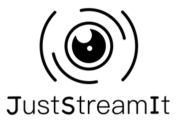

 
# DA-Python - Projet 6

### Description du projet
Développez une interface utilisateur pour une application web permettant de visualiser en temps réel un classement de films intéressants.

### Installation

#### Récupérer l'API OCMovies-API:

1. Cloner ce dépôt de code à l'aide de la commande `$ git clone clone https://github.com/OpenClassrooms-Student-Center/OCMovies-API-EN-FR.git`, 
vous pouvez également télécharger le code en temps qu'archive zip `(https://github.com/OpenClassrooms-Student-Center/OCMovies-API-EN-FR/archive/refs/heads/master.zip)`
2. Rendez-vous depuis un terminal à la racine du répertoire ocmovies-api-fr avec la commande `$ cd ocmovies-api-fr`
3. Créer un environnement virtuel pour le projet avec `$ python -m venv env` sous windows ou `$ python3 -m venv env` sous macos ou linux.
4. Activez l'environnement virtuel avec `$ env\Scripts\activate` sous windows ou `$ source env/bin/activate` sous macos ou linux.
5. Installez les dépendances du projet avec la commande `$ pip install -r requirements.txt`
6. Créer et alimenter la base de données avec la commande `$ python manage.py create_db`
7. Démarrer le serveur avec `$ python manage.py runserver

Pour plus de d'informations le fichier README.md de l'API est disponible à la racine du répertoire ocmovies-api-fr `$ cd ocmovies-api-fr` 

#### Récupérer les sources du projet et lancer l'application:

`$ git clone  git@github.com:bengomar/DA_Python_Projet_6.git && cd DA_Python_Projet_6`

Enfin depuis votre navigateur web ouvrir le fichier `index.html` sous `DA_Python_Projet_6`.
